### Hi, I'm Alaska 👋

- 🔭 Working on Windows internals & security tooling, mostly in C++
- 🌱 Also building in Lua/Luau for Roblox
- 🌐 [samoyed.sh](https://samoyed.sh) · [cherubim.solutions](https://cherubim.solutions)
- 💬 Ask me about reverse engineering, kernel drivers, or anything low-level

 

 

  

